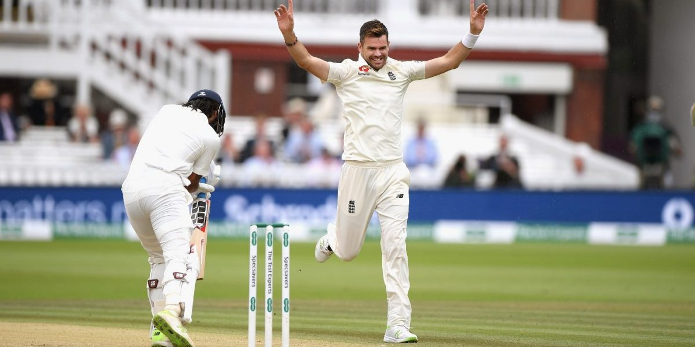

Who holds the record for most Test Wickets amongst fast bowlers? Glenn Mcgrath, with 563. James Anderson, currently at 557, is on the cusp of breaking the Australian’s momentous record. The tall former Aussie-paceman recently said that once James Anderson takes the 7 wickets required to surpass his tally, the record will stay with Anderson forever. Bold statement.

In a Rahul Dravid biography, there exists a chapter titled “Never Say Never Again”, which tells how a young Dravid, who used to keep wickets in his school days, had decided never to keep wickets again. Of course, the ace right-hander would go on to don the big gloves in 73 ODIs for India. So, when Mcgrath says never again would the record change hands, how accurate is he being, and does the data at hand really back up his statement?

## The Method

What works in James Anderson’s favor is the longevity of his career. A fast bowler is prone to a variety of injuries- after all these men of speed live in the fast lane and put their bodies through a grind like no one else. The only other fast bowler per se to play more Test Matches than Jimmy’s 141, is the South African all-rounder Jacques Kallis (166). The best for a full-time fast bowler like Jimmy is the first paceman to 500 Test Wickets- Courtney Walsh (132).

> So, how do we go on to quantitatively measure the veracity of old Glenn’s statement? Is there any present-day fast bowler who can go past Mcgrath and past the mark that Anderson himself sets? What mark is Anderson himself likely to set?

To answer these questions, at least theoretically, we take a look at multiple data points that can help us arrive at the total number of **“potential wickets”** that a fast bowler may take by the time he retires. The foremost is Wickets he has already taken **(Wickets)**. From this, we can find out how many wickets a match **(Wickets/Match)** does he take. The top 3 amongst currently active Fast bowlers are Dale Steyn (4.78), Kagiso Rabada (4.72), and Mitchell Starc (4.23)

The next question to be answered is for how many more years will he play? For this, we would require his age, and a threshold value, say X, at which point we can safely assume, that he will retire. In my analysis, I have taken the value of X as 38- the age at which Courtney Walsh retired- the oldest fast bowler to play a Test Match in this century. So, 38 minus the bowler’s present age gives you the number of more years he would play **(Years)**.

Next, I tried to find out how many more matches would the bowler play? This not only depends upon the number of more years he would be active, but also on his fitness levels, and the amount of Test Cricket his country plays. For assessing fitness levels, I had a look at the percentage of matches played by these bowlers out of their team’s last 25 Tests **(Fitness Level)**. Kagiso Rabada, Josh Hazlewood, and Jason Holder came out on top here, with each having played in 24 out of their team’s last 25 Tests. As for the amount of Test Cricket a country plays, I looked at the average number of matches per year for every team over the last 5 years **(Team Matches)**. England play the most- 12.4 with India and Australia close behind.

Potential Wickets is nothing but the sum of wickets he has already taken and wickets he would take later in his career. We already have the data for wickets taken up to this point. The product of years, team matches, and fitness level tells us the number of matches a fast bowler would play. Multiplying that figure with the wickets/match data, we arrive at the number of wickets he may take in the future. Putting all the above data points together, we arrive at the following formula to derive the number of potential wickets that a fast bowler may pick over the course of his career-

**Potential Wickets = Wickets + (Years * Team Matches * Fitness Level * Wickets/Match)**

## The Result

So where does James Anderson finish? To answer the question succinctly, he still has close to a hundred more Test Wickets in him and finishes a 164-Tests career with 647 wickets- 84 more than Glenn Mcgrath’s mark of 563. And does Anderson top the list? Not quite. He, in fact, finishes third!

Finishing ahead of him is his own teammate and bowling partner- the 32-year-old Stuart Broad, who should finish with 669 wickets to boot, and South Africa’s young turk, Kagiso Rabada, who at 23, has a potential 15 years ahead of him, and finishes his glittering 176-match career with 831 Test wickets against his name. Muralitharan, who?

Of course, these numbers aren’t and will never be a 100 percent accurate. Walsh is the only fast bowler to play aged 38, in this century and few will be able to match him and the likes of Anderson for longevity. Fewer still, Kagiso Rabada included, will be able to go through such an enormously long career with as much consistency and fitness levels that Rabada has shown in his fledgling career. He has much tougher times ahead of him as his body grows older, and his form goes through its own ups and downs.

What the numbers do tell though are that Mcgrath’s Nostradamic words may not hold true for long and somewhere down the line, there will come, or has already come, a fast bowler who will break his mark and even James Anderson’s, after all, as American star swimmer Mark Spitz once said, “Records are meant to be broken”. Keep an eye out for the blonde Brit, and the dark-skinned Protea, will you?

*Photos: Getty Images*
