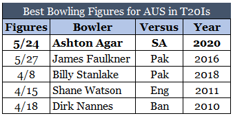

South Africa took on Australia in the first of the three T20Is at the Wanderers in Johannesburg on Friday. Having scored 196/6 batting first, the Aaron Finch led visitors took a 1-0 lead with a crushing win over Quinton de Kock’s South Africa, bowling them out for a measly 89. Here are the stat highlights from the game –

**2** – Number of Australian bowlers to take a Hat-trick in T20Is. Brett Lee took the first ever T20I hat-trick versus Bangladesh in Cape Town at the World T20 in 2007. More than 12 years later Ashton Agar took one here. This was the first hat-trick in T20Is against South Africa.

**5** – Wickets taken by Ashton Agar – the second instance of an Australian taking a 5-fer in T20Is after Faulkner versus Pakistan in 2016. Agar’s 5/24 are the best T20I figures for an Australian.

**89** – South Africa’s total score – the lowest ever for them in a completed T20I innings, going past the 100 they managed against Pakistan at Centurion in 2013.

**107** – The margin of defeat for South Africa – their largest ever. The previous record was a 95-run-win recorded by Pakistan in 2013. The largest win for Australia over South Africa before this was a 52-run win in Melbourne in 2009.

*Feature Image – AP*