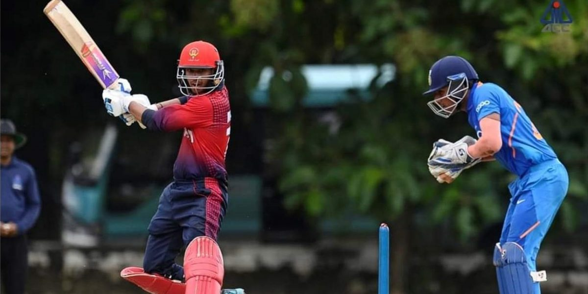
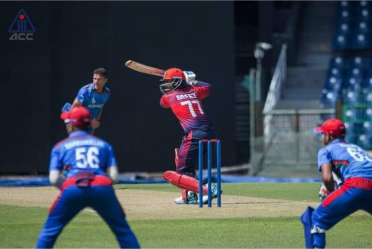
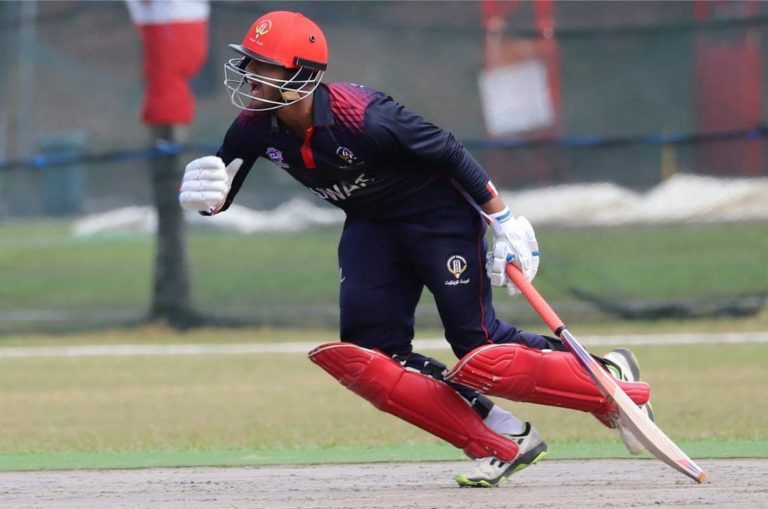

The International Cricket Council in 2018 decided to grant T20I status to all of its 104 member countries. Kuwait is currently ranked 28 in the ICC’s T20I rankings – just one spot behind the semi-finalists of the 2003 World Cup – Kenya. They met Maldives in Al Amerat, Oman, to play what would be both the countries’ first international cricket match. Among the 22 men who lined up for their as well as their country’s debut, was a boy, all of 14 years and 211 days. Meet Meet Bhavsar – a left handed wicket keeper cum opening batsman from Kuwait – the youngest male international cricketer on the planet.

Here are a few excerpts from a conversation that we recently had with Meet.

**Hey, Meet. You’ve had quite the rise in your cricketing career. Could you rewind the clock a bit and tell us how it all started?**

Well, I was born and have been brought up in Kuwait itself. I took up cricket when I was five or six years old. It was my mother who taught me how to hold a bat. A year later, I joined a cricket coaching club run by my coach, Mr. Jude D’Silva, and that is where I took my first steps in this journey. Coach D’Silva, who also coaches our country’s Under 19 team, has been a great influence in my growth. It was he in fact, who noticed that I was quick on my feet, and asked me to try my hand at wicket keeping when I was 11.

**You’ve played for both the Kuwait senior as well as the under 19 team. In fact, with the under 19s you’ve played against teams from Test playing nations such as India, Pakistan, and Afghanistan. How has that experience been?**

It is always a great experience playing against these big teams as you get to learn a lot from them. Through these games I got to personally interact with professional cricketers such as Pakistan’s Naseem Shah (who made his Test debut at the age of 16 in October 2019) and several Indian cricketers such as Atharva Ankolekar and Akash Singh, who recently played at the U-19 Cricket World Cup. In fact, I also hit a six over the covers off Akash Singh, in a game where we really competed well against India. Opener Gokul Kumar and I had a really good partnership of more than 50 runs!

**Talk us through your debut game against Maldives. You didn’t get to bat in that match, but being the wicket keeper must have meant you were really involved.**

There were a bit of nerves as it was my first T20I. Yes, I didn’t get to bat in the match as we won by 8 wickets, but I was involved in a runout and that was a really special moment behind the stumps for me.

**Were you aware of the record you had set?**

No actually, I wasn’t. I was told that I was Kuwait’s youngest player, but I had no idea that it was a world record!

**In your very next game, you walked in when your team was in trouble and almost took them home. That match ended in a tie, though and you guys lost in the super over, isn’t it?**

Yes, that was a very special game for me. I batted at number 6 in that match and when I came to bat we still needed 97 runs in 10-odd overs. I really gave everything in that game and was involved in an amazing 84-run partnership with Muhammad Kashif. It is heart breaking when you work hard, but unfortunately can’t win the game for your country.

**Your batting partner, Muhammad Kashif, was more than twice your age in that partnership. How important was his presence during the tense chase?**

He was more concerned about my innings than his! We were probably the last recognised pair and he just kept telling me to rotate the strike and not be in a hurry to hit sixes.

*Meet scored 38 and Kashif 53. Their partnership was worth 84 in 50 balls and brought Kuwait back into the game.*

**You batted at number 4, 5, and 6 in your initial T20Is, and then moved to opening the batting. Who made that call?**

I used to open for our Under 19 team. But with more experienced batsmen in our senior side, the team management felt that I should bat in the middle order initially. However, after seeing my performances in the Division A games as well as practice matches, they decided to let me open, which is my preferred position.

**Opening the batting as well as wicket keeping must be a difficult task, especially in the 50 over games.**

Yes, of course. I mean playing in humid conditions in Malaysia last summer (where Meet scored 102 for the U-19 team in April) was really difficult. After that long innings, I had to keep wickets as well and that caused a lot of cramps. I had to keep drinking water and push on through that pain.

**Playing international cricket must involve a lot of travel?**

Oh, yes. I have played in 7 countries – Kuwait, Qatar, Oman, Malaysia, Singapore, Thailand, and Sri Lanka. That’s the time when I can relax a bit and listen to some music. I like to use this time to think about the upcoming games.

**How do you balance your academics with so much of Cricket and travel?**

It is really difficult. But when you take your passion as your profession, it doesn’t matter. I study whenever I get a bit of time. Cricket is not very popular in the gulf. People usually prefer football here, so I don’t really get any special allowances at school with respect to attendance.

**What are your plans for the future?**

Well, my future plans are mostly to continue in Kuwait, and try to give my time and the best of my efforts for the country and take my cricketing career long. As for academics, I haven’t really decided anything yet, but I will probably continue in Kuwait.

**All us cricket fans have a childhood favourite. Who is yours?**

I really admire Mahendra Singh Dhoni.

**Do you follow the IPL? You must be a Chennai Super Kings fan, if you do. Any plans to come and watch them live in India?**

Yes, I do of course follow the IPL. I follow the Mumbai Indians though.  I have been following them ever since Sachin Tendulkar played for them, and I continue to root for them. I would love to come to India and watch all these legends play, but really can’t at the moment with all the cricket and academics here in Kuwait.

**You said your mother introduced you to Cricket. Who is her favourite cricketer?**

I have often asked her this question myself on several occasions and she always says that I am her favourite cricketer.

**That’s very sweet of her. It was a real pleasure talking to you, Meet. Wish you all the best for your upcoming assignments.**

Thank you so much. The pleasure was all mine.

*Photo Credits – Asian Cricket Council*