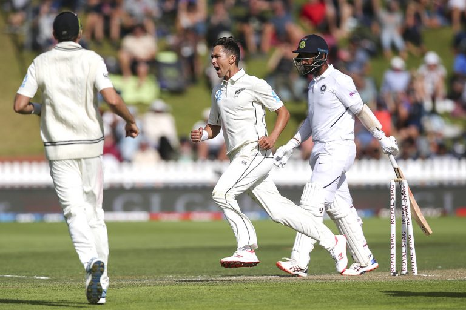
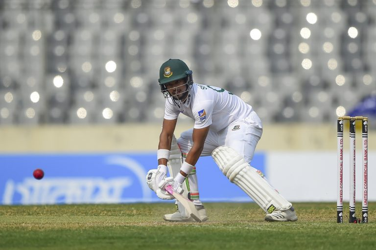
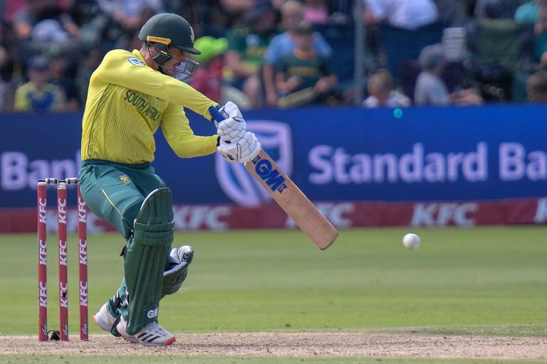
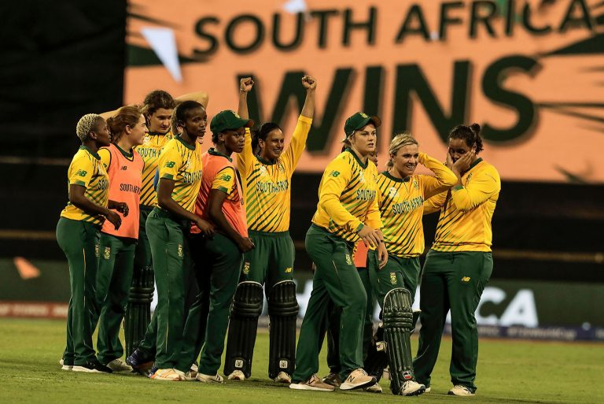

Super Sunday saw 4 international matches being played across all 3 formats. Here is a recap of how they panned out.

## Men’s Test Matches
### New Zealand v India, 1st Test, Day 3

*Photo – Getty Images*

Having fallen behind the Test following their failure with the bat on the first two days, India hit the ground running on Day 3. Watling and Southee fell early in the day, and with New Zealand 7 down, and only 60 ahead, India would have been entertaining of limiting the damage and New Zealand’s lead. However, enterprising knocks down the order from de Grandhomme (43), Jamieson (44), and Boult (38) saw the Kiwis’ first innings lead swell to 183.

India’s hopes of still making a match out of it kept getting jolts at regular intervals as Shaw (14) was done in by a bolt from Boult; Pujara (11) left alone a Boult delivery that came in with the angle and shattered his woodwork; Agarwal (58) tickled a delivery that was going down the legside to the keeper; and Kohli (19) fell trying to take on a bouncer. Rahane (25) and Vihari (15) held fort in the evening to ensure India did not slip further.

**India 165** (Rahane 46, Jamieson 4/39, Southee 4/49) and 144/4 (Agarwal 58, Boult 3/27) trail **New Zealand 348** (Williamson 89, Ishant 5/68) by 39 runs

### Bangladesh v Zimbabwe, Only Test, Day 2

*Photo – AFP*

Bangladesh continued to wrestle back control as they cleaned up Zimbabwe’s tail in quick time, bowling them out for the addition of 37 runs to their overnight score of 228/6 with Taijul Islam and Abu Jayed picking up two wickets each.

In response, Zimbabwe struck early, removing Saif Hassan for 8. However, partnerships of 78, 76, and 68* followed to ensure Bangladesh ended the day well and truly on top. Tamim Iqbal (41) delighted on his return, but the stars of the day for the home side were Shanto and skipper Mominul Haque, who with their twin 70s grounded down Zimbabwe’s attack.

**Zimbabwe 265** (Ervine 107, Masvaure 64, Nayeem 4/70, Abu Jayed 4/71) lead **Bangladesh 240/3** (Mominul 79*, Shanto 71) by 25 runs

## Men’s T20I Matches
### South Africa v Australia, 2nd T20I

*Photo – Associated Press*

0-1 down, the home side opted to bat first. Skipper Quinton de Kock, who has been in fine form, decided to take on the Australian pacers on straight away. Pat Cummins was greeted in the second over of the day with a pull off his second ball that went all the way. Two balls later, de Kock played a lap short over fine leg for six more. Starc wasn’t spared either as another pull from de Kock in the next over, soared into the stands. Kane Richardson came on in the fourth over, and de Kock greeted him with boundaries of each of his first two balls. Spin replaced pace inside the powerplay only, but that made no difference as QDK pulled Zampa to the fence and then followed it up with a hit down the ground for six. de Kock was flying and so were South Africa. 59/0 in 6 overs with de Kock on 43.

The breaks came on soon after as Hendricks fell two balls later. Ashton Agar – hero from the previous game was instrumental in slowing the home team down as both QDK and du Plessis struggled to put him away. Richardson too kept things tight as only 41 came off the seven overs post the powerplay. With only seven overs left in the innings, de Kock threw caution to the winds, sweeping Agar to the fence, while van der Dussen slog swept him for six. Another slog sweep followed in the next over from van der Dussen’s bat – this time off Zampa. Having smashed 43 off 20 in the powerplay, de Kock managed only 27 in 27 post that, and fell to Zampa in the 15th over. van der Dussen kept them going and his 37 guided them to 158/4 in their allotted 20 overs.

Much like South Africa, the Aussies began strongly in the powerplay racing away to 47/0 in 4.3 overs before Aaron Finch chopped a length ball from Ngidi on to his stumps. The not-so-popular-in-South-Africa pair of Smith and Warner kept the chase well on track as Australia marched to 84/1 at the halfway mark, needing 75 more. As in the first innings, a spinner – in this case, Shamsi, slowed the innings down. Pretorious took Smith down in the 13th over, and runs continued to be hard to come by. Alex Carey broke the shackles lofting a slower ball from Ngidi for six, but was castled by a quicker one two balls later. That six from Carey, off the first ball of the 16th, was to be the last one for Australia, as they managed only 24 runs off the last 29 balls, despite the presence of Warner, and fell short by 12 runs, courtesy an incredible performance with the ball from the Saffers.

**South Africa 158/4 in 20 overs** (de Kock 70, van der Dussen 37, Richardson 2/21) beat **Australia 146/6 in 20 overs** (Warner 67*, Ngidi 3/41) by 12 runs.

## Women’s T20 World Cup
### England v South Africa

*Photo – Getty Images*

In an upset of sorts sixth-ranked South Africa trumped second-ranked England in their first match of the tournament. Having won the toss, South Africa put the favoured side in first. ‘Keeper Amy Jones got the English ladies off the blocks quickly. However, the fact that she hoarded the strike and deprived her partner largely of the strike, meant one bought two for South Africa and England were soon 26/2 early in the 5th over. Heather Knight joined Natalie Sciver, but neither this experienced duo, nor Fran Wilson, who walked in next, could force the pace as England ambled on. By the time Wilson fell, they had only 72/4 on board and had a little more than 5 overs in hand. Natalie Sciver, who was batting on 23 off 28, then got a move on adding 27 more in her next 13 balls, to help England manage 123/8.

England needed to strike early to make a match out of it, and Anya Shrubsole provided just that – sending back Lizelle Lee in the third over. That though was to be the only success England would taste for quite some time as captain Van Niekerk and Kapp drove the chase manfully with periodic strokes to the fence breaking a steady sequence of singles and doubles. The pair however, fell in quick succession after an 84-run-association to give England a glimmer of hope. An excellent 17th over from Ecclestone that yielded a wicket and conceded just a single run, saw the required rate jump to 10.67.

Sciver began the 18th with one down the legside that Jones failed to collect, leaking four byes. A top edged four off the third ball added to Sciver’s frustration, and took South Africa closer. With 7 needed off 4 balls, Mignon du Preez launched a powerful flick shot over backward square leg for an incredible six, levelling the scores. The next ball – a full toss was swung in the same direction for four more, handing South Africa a massive win.

*Feature Photo – Associated Press*