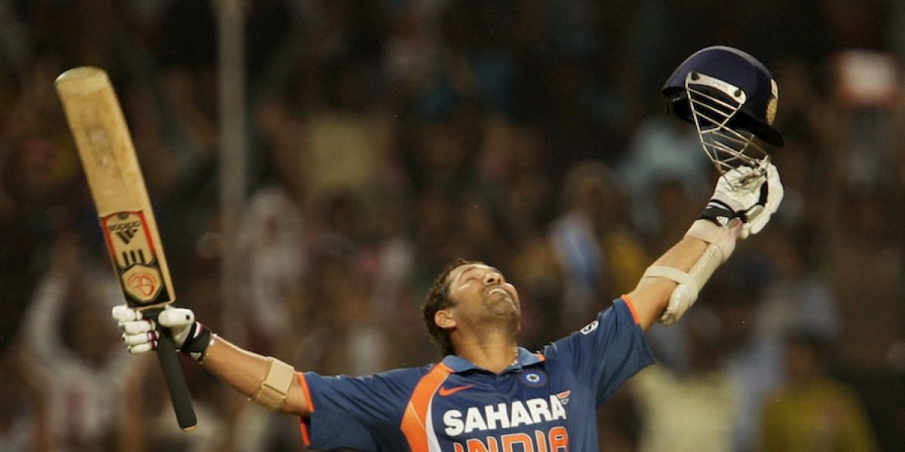

When ODI Cricket first came about in 1971, no one really thought of this milestone as a practical possibility. New Zealand’s Glenn Turner hit an unbeaten 171 in the very first World Cup against a weak East Africa side. That innings took him 201 balls – in a 60 over match. Then one fine day in 1984, a storm hit Manchester, England as Viv Richards tore into the English attack. Walking in at number 4, Richards smashed an unbeaten 189 in a 55 over match and the world opened up to the possibility of a double hundred in ODIs. Three years later, Richards came close again, conjuring a brutal 181 against a hapless Sri Lankan attack at the World Cup. The man had taken only 125 balls and was at the crease for less than forty overs. Surely a double hundred was doable?

Many came close – Kirsten, Jayasuriya, Anwar, Ganguly, Tendulkar, Coventry, Hayden; but none could surpass the mark. The hype around the mark only grew due to its elusiveness. A mountain no one thought existed at first; a mountain that then seemed impossible to scale. Who would be the first man to achieve the feat? Gayle? Gilchrist? Jayasuriya? Surely, it had to be an opener.

In the evening of 24th February 2010, in a packed stadium in Gwalior, with a steer past point that yielded a single, a man finally got to ODI Cricket’s proverbial “Everest”. In Ravi Shastri’s words, it was the “Superman from India” – Sachin Ramesh Tendulkar.

Here, a few then-teenagers who grew up not only idolising the man, but also worshiping him recall the landmark moment.

**Jay Yadav** *was one of the lucky few to experience the moment live in Gwalior*

> “Once he reached 150, everyone in the stadium started talking of the milestone. Every run from Sachin’s bat was cheered. By the time the final few overs were left, MS Dhoni was on song, having hit a few big ones. But nobody cared and neither did I. All of us wanted Sachin on strike.

Dhoni hit a six, and the crowd bellowed “We want Sachin”. Dhoni took a single off the final ball of the 49th, and the crowd roared, “We want Sachin”. When Sachin finally came on strike, guided the ball to point, and set off for a tight single, all of us collectively took a breath in, and only exhaled once Sachin had crossed the 22 yards. There are no words to describe what followed. It was like we had won a war – a long awaited one at that too.”

**Achal Gupta** *counted the runs alongside the minutes in a lecture hall*

“Everyone was in class at that time. But, we were following the scores. Sachin crossed the 50 mark, then 100, then 150, and he was batting on about 175 when we requested the professor to dismiss the class. Our professor, a Tendulkar fan himself, obliged and we ran to our hostels. Like any typical engineering boys hostel setting, the common room was packed to the rafters – nothing short of a stadium like atmosphere, cheering every run leading to the landmark moment.”

**Nitesh Kumar** *shared the event with his entire school*

“We, at Sainik School, were watching this match live on the only television available for 900 students. As seniors, we had the best seats in the room. It didn’t matter in the last 10 overs as we stood and abandoned our seats in anxiety, most of us cursing Dhoni while he hogged strike during the last few overs. We missed the mandatory roll calls (fall in) that evening, and we had our exams, but we chose to live the moment we were waiting for a decade – to see the man crossing the mental barrier of the cricketing fraternity, scoring a 200 in ODIs for the first time.”

**Raviteja Mahavadi** *surreptitiously watched the show on the eve of his Board Exams*

“On the 24th, I was at my uncle’s place, following the match without letting him know as my intermediate boards commenced the next day. However, when Sachin crossed 150, I insisted on switching to the television. The potential moment deserved a bigger screen. We were united in our exasperation with Dhoni not giving Sachin enough balls to face. Our love for Sachin and anticipation for the event had overpowered the performance of Dhoni for the team.”

**Amod Tripathi** *saw the landmark unite strangers in an unknown city*

“I was at Kota during that time, preparing for engineering entrance exams. Students in my locality (from all over the country) used to assemble in the porch of a general store where there was a small TV he placed to attract students. On that day, there were more than a hundred students flooding the shop and jamming the road to watch that singular moment and the celebration afterwards was comparable to the emotion at the stadium.”

**Girish Tiwale** *on perseverance and fourth time being the charm*

“I was coming back home when I saw the crowd was gathered in front of a small grocery shop. The only thing that the shopkeeper said to me was, “Park your bike on the side. Sachin is close to his double century.” I did the same and joined the crowd to witness history I couldn’t have forgiven myself for, had I missed that moment. Even before he touched the 22 yards at Gwalior that day, it was believed by millions of his devotees, if there is anyone who can make a double century in ODIs, it would be none other than the immortal Sachin Tendulkar. Thrice, he had come close to this feat since 1999, and thrice hearts had broken all over the country. It’s not only that particular innings in Gwalior that made the 200 special for his fans. These other three selfless innings had an equal share in the final impact of fulfilled dreams.”

**Ravi Sonagra** *took to the streets for the day*

“My 10th Boards were due to start within a week, so of course we didn’t have a television connection at home. I grabbed my books and told my mom that was heading over to a friend’s place for revision and proceeded to stand outside a Pan parlour to watch the match for 3 straight hours. This came out of sheer love for the sport; I hadn’t expected him to achieve this feat earlier in the match. But once I realised the possibility, I prayed fervently for this accomplishment and cursed Dhoni for every ball he played. Ravi Shastri’s words on air, “the first man to reach 200 runs and it’s Superman from India” gave me goosebumps!”

**Rahul Burman** *knew that even trains wait for Sachin*

“I was packing my clothes for a night journey to my hometown as I watched the match live on TV with bit of commentary on Cricinfo. I stopped packing in the middle and watched the complete innings. That day I almost missed the train, even got a scolding from parents who didn’t think my ‘just in time’ philosophy was justified. Ravi shastri’s commentary when he reached double century mark. “First man on the planet to score a double century in ODIs and it is the ‘Superman’ from India” defined the moment perfectly.”

**Rujul Godse** *witnessed cricket as the religion fuelling lives in our country*

“I was at home, taking care of my grandmother during some of her last days. Once Sachin scored 150, I had a gut feel that he would make 200. Grandma used to follow cricket as well and Sachin was her favourite. I literally gave her an update after every over post his 150. Though she couldn’t watch the match, she was able to listen to the commentary. MSD was in red hot form at the other end and Sachin seldom got strike. Initially, we hoped he would beat the world record for the highest score at the time. And then came the moment! My entire township was inundated in a loud roar! Sachin Tendulkar the first man on the planet to score an ODI double. Take a bow little master! For a moment, his double buried all the pain grandma had. Everyone right from a 6 year old kid rejoiced that moment. Probably 1 billion lives came to a standstill.”

**Sharang Dhomse** *participated in the race of a lifetime*

I remember that day well. I watched the initial part of the innings before leaving for my class. Halfway through the class, we came to know that Sachin was batting in the 140s with time in hand. We requested our tutor, Mr. Inamdar to let us off. Being a Sachinist himself, he had been asking us for scores every now and then, and he graciously obliged. I grabbed my bicycle and raced home. That is probably the fastest I have ever ridden in my life. I got home by the time the master entered the 170s and watched the big moment on a big screen.

**Eshan Gupta** *found himself the nearest TV*

I was in my maths tuition when I got to know that Sachin was on 175. I managed to excuse myself and rushed to a neighbourhood kirana store that had a small television. It was almost dark, but a few other kids also gathered, and we watched the final part of the innings together.

*Edited and compiled by Revati Dass*