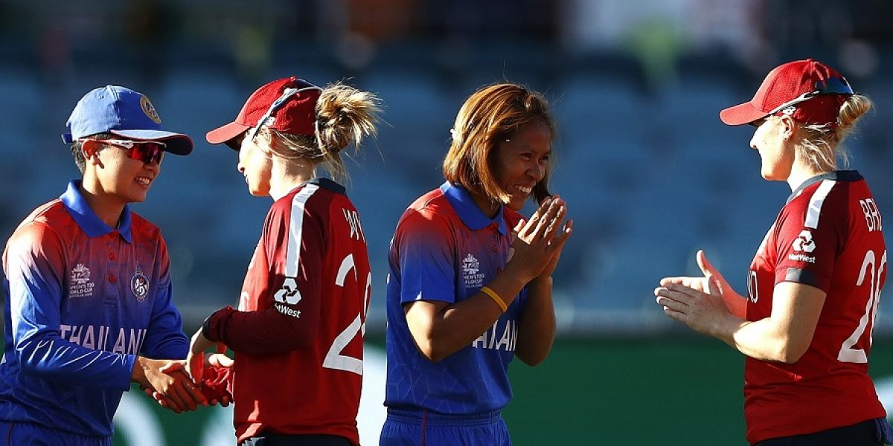
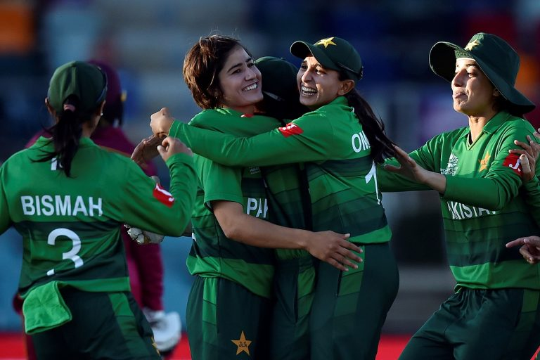
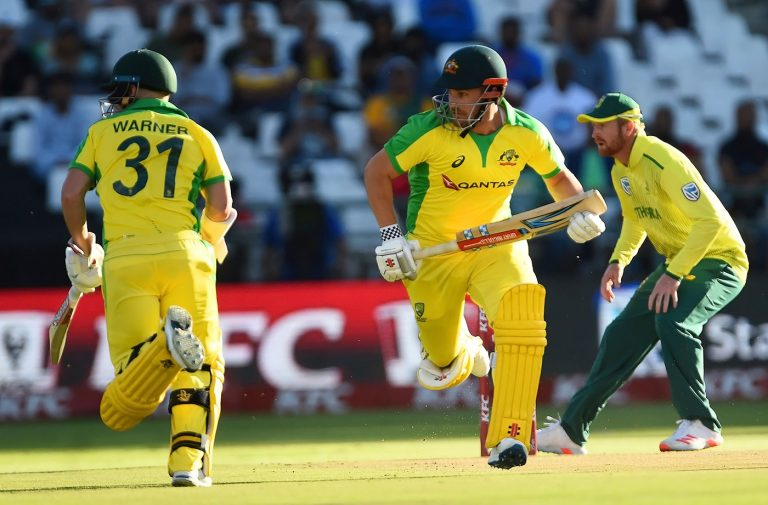

The highest Men’s ODI total without hitting a six. Thailand Women giving England women a momentary, but momentous scare. That and more, in the International Cricket Round up for the day.

## Women’s World Cup
### England v Thailand
Though both sides came into the game following a defeat in their opening fixture, one side was a tournament favourite while the other was playing its country’s first top level cricket tournament. If there was to be just one David v Goliath battle in this tournament, it was this – it was definitely this. But, Goliath as always, came armed with a catapult and brought it out so early in the game, that he, or rather she, smacked one in David’s eye. 5 minutes into the game and England had lost both their openers with neither bothering the scorers. England had not only been kicked out of bed – they had been drenched in ice cold water, slapped furiously on their cheeks, and kicked out of the bed – all of this before they could even open an eye!

Captain Heather Knight joined Nat Sciver in the second over and the two straight away got to work. They were cautious at first – 24 dots off the first 50 balls they faced together, though they were laced with frequent strokes to the fence. Once, they knew England had entered safer waters – at 74/2 in 10 overs, the shoulders opened up and the dots dried up – there were only 11 of them in the 60 balls as England added 102 more runs without losing a wicket. Heather Knight was the dominant of the two and while Nat Sciver managed a nice little 59*, the English skipper became the first woman to score an international century in each of the three formats of the game.

Chasing 177 was a distant dream for the Thai, and it became even more so when Shrubsole sent opener Boochatam back of her first ball. Chantam and Koncharoenkai put on a nice partnership – facing close to 13 overs together before they could be separated, but the chase was never really on. Once Ecclestone got through Chantam, the Pandora’s box was open, and out walked pandemonium as Thai lady after Thai lady came, and Thai lady after Thai lady went back, eventually falling 98 runs short of England. David had had the laugh for 38 overs after being rudely awoken in the first two.

**England 176/2 in 20 overs** (Knight 108*, Sciver 59*) beat **Thailand 78/7 in 20 overs** (Chantam 32, Shrubsole 3/21, Sciver 2/5) by 98 runs

### Pakistan v West Indies

*Photo – Getty Images*

Pakistan registered their first win of the tournament and handed the West Indies their first loss in yet another surprising result at the Women’s T20 World Cup. The result was even made even more surprising owing to the ease with which the Asian side bested the more fancied side from the Caribbean.
Having lost three early wickets, and hardly finding any tempo in the powerplay, captain Taylor and ‘keeper Campbelle resurrected the West Indian innings with their twin 43s. However, with no significant contribution from anyone down the order, the Windies ended up with just 124 on the board.

Any hope that the West Indies had of making a match out of it, were squashed by a series of steady scores by each of Pakistan’s top order batters. Muneeba (25) and Javeria (38) added 58 for the first wicket. Once they made way, captain Maroof (38*) and Dar (18*) helped Pakistan coast to victory with an unbeaten 50 run stand.

**West Indies 124/7 in 20 overs** (Campbelle 43, Taylor 43, Baig 2/19) lost to **Pakistan 127/2 in 18.2 overs** (Maroof 38*, Javeria 38) by 8 wickets.

## Men’s ODIs
### Sri Lanka v West Indies, 2nd ODI
Having won the first ODI by the thinnest of margins, Sri LAnka bought their A game to Hambantota, and absolutely thrashed the Windies. Batting first, Sri Lanka rode on the back of centuries from Avishka Fernando and Kusal Perera to post the highest score in Men’s ODIs without hitting a single six in the innings. The pair joined hands with the hosts struggling at 9/2 and put on 239 together for the third wicket. With the platform set, the middle and lower order chipped in with decent contributions to take Sri Lanka to a daunting 345.

West Indies’ began sedately, looking to keep wickets in hand, but regular wickets after an opening partnership of 64, meant that their innings never took off and eventually capsized with Hasaranga and Sandakan sharing three wickets each.

**Sri Lanka 345/8 in 50 overs** (Fernando 127, Perera 119, Cottrell 4/67, Joseph 3/57) beat **West Indies 184 in 39.1 overs** (Hope 51, Hasaranga 3/30, Sandakan 3/57) by 161 runs

## Men’s T20 Internationals
### South Africa v Australia, 3rd T20I

*Photo – Getty Images*

With the series level at 1-1, only one side seemed to have turned up for the decider at the Newlands. Put in to bat first, the Australia openers got their side off to a flyer yet again, with both Warner and Finch notching up half centuries. By the time they were separated in quick succession, the Australia’s were well on their way to a good score and despite a slight slow down in the middle when Wade and Mitch Marsh were in the middle, Steve Smith ensured that Australia put a sizable score on the board.

Chasing 194 to take the match and the series, the home side lost its captain and man in form, de Kock, in the first over itself, and never recovered from the blow. Only three South Africans entered double figures and none of them touched 25 as wicket after wicket tumbled in an effort to keep up with the required run rate. With Starc, Zampa, and Agar, sharing 8 wickets between them, South Africa fell short of matching even half of Australia’s 193.

**Australia 193/5 in 20 overs** (Warner 57, Finch 55, Smith 30*) beat **South Africa 96 in 15.3 overs** (Agar 3/16, Starc 3/23, Zampa 2/10) by 97 runs