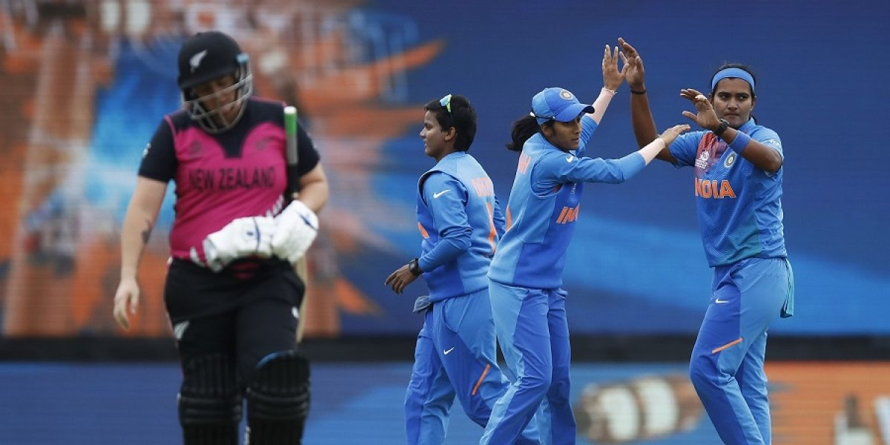

## Women’s T20 World Cup

### India v New Zealand

India continued their impressive run in the tournament and became the first team to qualify for the Semi Finals. Put in to bat first, India were jolted early – losing Smriti Mandhana early. However, teen sensation Shafali Verma continued her rich vein of form at the top. With Verma finding the fence once in three consecutive overs of medium pace, Devine bought on an off spinner in the fifth over, only for Verma to smash her for consecutive sixes. India ended the powerplay with 49 on the board.

While India kept finding one boundary an over post the powerplay, the Kiwis wrestled back some control with spinners Kasperek and Kerr striking at regular intervals. Once Mair dismissed Bhatia in the 10th over, India’s next few partnerships lasted for 12, 11, 5, 10, and 10 balls respectively. The wickets slowed them down and never gave them the space needed for a final surge and the Asian side ended up with just 133 on board.

The Kiwi chase began ominously with ‘keeper Priest scoring 12 off the first over bowled by Deepti. However, Shikha Pandey, who had starred with the ball against the Aussies, removed Priest in the very next over. With Pandey and Gaykwad applying the breaks, the Kiwis were desperate to break the shackles in the powerplay. Deepti, who was brought back to bowl the sixth benefitted from this as the dangerous Suzie Bates fell while trying to scoop Deepti in an effort to make maximum use of the field restrictions. New Zealand ended the powerplay with 30/2 against their name, despite 12 coming off the first.

Poonam Yadav’s introduction made things tougher for the Kiwis as the runs dried up further. Poonam conceded 3 in the seventh, and Radha 1 in the eighth. The pressure got the better of captain Sophie Devine, who had smashed a 77 not out in the previous game, as she fell trying to clear the infield off Poonam’s second over, finding who else but Radha on the off side.

Maddy Green and Katey Martin combined to add 43 for the fourth wicket in 37 balls, but by the time they were separated New Zealand were left needing 57 in 34. Which is when Amelia Kerr walked in. Kerr found a boundary early in her innings, but lost Martin soon. The equation came down to 34 in 12 with Kerr on 11 in 10. The last two overs though were to be all about the Kiwi all-rounder.

Poonam came on to bowl the 19th and Kerr went 4, 2, 4, 0, 4, 4 – taking 18 off her to bring the equation down to 16 off 6. While the other Kiwi batsmen were trying to charge the Indian spinners to put them off their lengths and failing, Kerr stayed back, and made use of the depth of the crease with rich dividends. Shikha Pandey came to bowl the last and was greeted by a boundary from Jensen. 12 in 5. Three singles later New Zealand needed 9 in 2 with Kerr on strike, and the lady once again brought her improvisation to the fore to find the fence with a scoop shot. 5 to win, 4 to tie. Pandey kept her cool, and Kerr couldn’t put the yorker away off the last ball as India escaped with a 3 run win with Kerr finishing on 34 off 19.

**India 133/8 in 20 overs** *(Shafali 46, Kerr 2/21) beat* **New Zealand 130/6 in 20 overs** *(Kerr 34) by 3 runs.*

### Australia v Bangladesh

*Photo – Getty Images*

Coming on the back of a defeat to India, and a top order collapse against Sri Lanka, the Australian top order had a lot to prove. And prove they did against Bangladesh, with openers Beth Mooney and Alyssa Healey putting on a national record opening partnership of 151. The ‘keeper Healey, who had come into the tournament with a string of low scores and then scored 51 against India and a duck against Sri Lanka, was the more aggressive of the two – slamming 83 with 10 fours and three sixes. Once Salma Khatun finally managed to send her back, off the last bowl of the 17th, her namesake Alyssa Gardener took over from where she left, smashing a 9-ball-22. Australia finished with a tournament high of 189/1 with Mooney unbeaten on 81.

Bangladesh were never expected to challenge the massive score, and the wheels started come off their chase early in the innings, with Schutt’s twin strikes in the fourth over. Bangladesh ended the powerplay at 27/3 and the result was a long foregone conclusion. Fargana Hoque made the only noticeable contribution with a 35-ball-36 as Bangladesh ended up with 103/9, conceding the game by a massive 86 runs.

