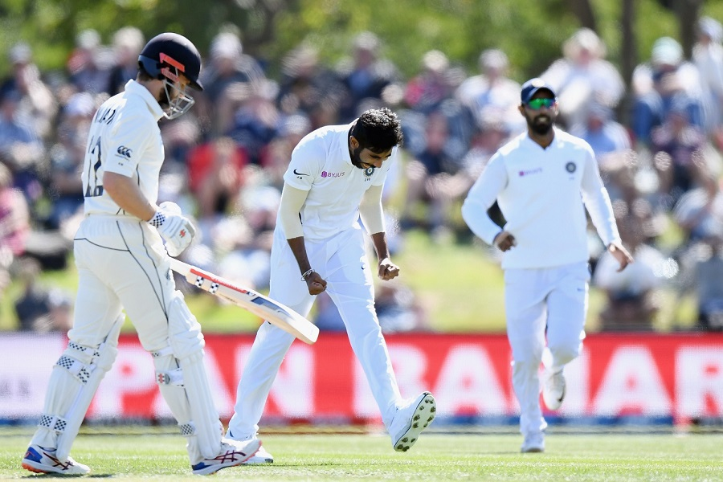
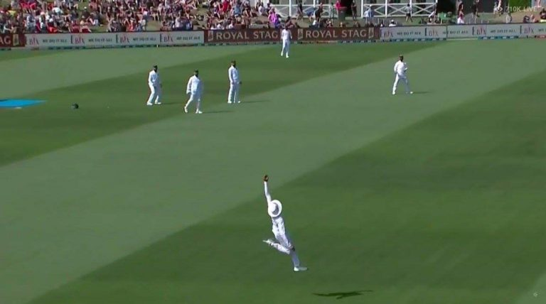

Whitewashed in the ODI series, convincingly beaten and handed their first World Test Championship in the first Test, and a largely poor start to the second Test - it's not the best of times to be a fan of the Indian men's cricket team. But, that was so only until today morning. Those who bothered to wake up in the wee hours of Sunday were treated to a wonderful comeback led by the Indian pacers, while those who woke up late and checked the score before getting out of their bed, were gifted a bright smile to start things.

New Zealand began the day 179 runs in arrears with all 10 wickets in hand, having bowled India out for 242 and then eased themselves to 63/0 on Saturday. If anything, it seemed Sunday would also be a struggle for the visitors. But 'twas not the case.

Umesh and Bumrah began proceedings. The former, in the XI as a replacement for the injured Ishant, delivered in his very second over of the day, trapping Blundell in front of the wicket with a full ball shaping away from the right-hander. **66/1**. Kane Williamson - the New Zealand captain, replaced him, but didn't last long either; edging Bumrah to the 'keeper. **69/2**.

Ross Taylor and Tom Latham brought back some stability and saw off Umesh and Bumrah. New Zealand went to drinks without any further losses. The introduction of spin, in the form of Ravi Jadeja, might have given New Zealand some breathing space. However, Ross Taylor fell to the left arm spinner in an attempt to take him own and make what might have seemed to be "easy" runs. **109/3**.

Tom Latham kept the scoreboard ticking, now in company of Henry Nicholls, and brought up his 50. However, Shami, the only wicketless bowler till then, sent him packing in the very same over. Latham, in quite a Pujaresque manner decided to left one only for it to seam back and further come in with the angle and take one bail off with it. **130/4**.

Nicholl's didn't last long, poking at one, and finding a pretty pumped up Kohli in Shami's next. **132/5**. Colin de Grandhomme came next and edged one to the fence first ball. Bumrah then had a big appeal turned down as India lost a review in the next over. It was all happening. The pair of de Grandhomme and Watling somehow saw through it to take New Zealand to lunch with 142/5 on the board.

CDG began in a convincing manner post lunch, finding the fence once each of Bumrah and Shami in the first two overs. At the other end though, it was mayhem - mayhem from Jasprit Bumrah. Watling drove at a wide ball and found Jadeja at backward point. Two balls later, Southee edged a back of length delivery to Pant, and the double wicket maiden brought New Zealand to their knees. **153/7**.

But then out walked that familiar foe of many a Indian bowling line ups over the years - the dreaded tailender. While it is not fair to label Kyle Jamieson so, he was walking in at number 9, with the last 7 wickets having fallen for the addition of just 87 runs. The last 3 wickets almost managed the same between them.

Jamieson and CDG were on there way to putting on a rare respectable partnership for the Kiwis, chopping down on India's lead at the same time, when Jadeja turned up with a ripper to take the latter's off pole. **177/8**. It was the third time in 14 balls that Jadeja had dismissed the Kiwi all-rounder on this tour.

Neil Wagner, back on national duty after a shot paternity leave, hung in, while Jamieson took the bowling on - pulling the short ones, and punching the full ones, as the Indian hopes of taking a sizable lead kept dwindling. The duo added 51 runs together and it needed celestial interpretation from Ravindra Jadeja to separate them. We won't describe the catch here, because - a) we just can't put it in words and b) you have got to see it, to believe it. **228/9**.

*Photo - Screengrab from coverage on Hotstar*

Bumrah came on to bowl the next and Jameison lofted the man with figures of 3/55 over mid on for four first ball. Three balls later, Bumrah pinged him, all of 6'8, on the helmet with a short one. Did the blow have something to do with his dismissal next over? Probably yes, as he was hurried up by a short one from Shami and the top edge off the attempted pull was snaffled up by yet another screamer, this time by Pant. The underfire Indian 'keeper sprinted towards square leg, and dived full length to his left, to hold on to the skier to end Jamieson's innings on 49, and New Zealand's on **235**. 

India had a slender 7 run lead. Who would have thought that would be the case at 4 AM IST today?

Catch all the Kiwi wickets to fall today morning [here](https://www.hotstar.com/in/sports/cricket/icc-world-test-championship/new-zealand-vs-india-m600815/match-clips/2nd-test-nz-1st-innings-fow/1260022415).
